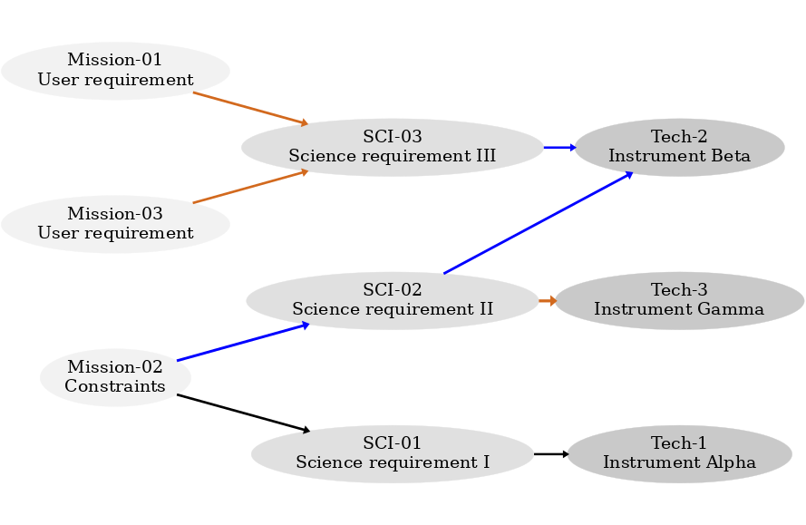

[](https://zenodo.org/badge/latestdoi/68635117)
[](https://travis-ci.com/douglase/doorstop_requirements_template)

#  doorstop Requirements Template


## Features:
* version controlled requirements tracking
* Generates a graphviz diagram (see example at bottom of page) showing relations between requirements
* Uses pandoc to translate doorstop generated html pages into github friendly markdown with links that work on github

## Requirements

* Bash
* doorstop (Browning and Adams, 2014,
  * http://dx.doi.org/10.4236/jsea.2014.73020):
  * https://doorstop.readthedocs.io/en/latest/#setup
* pandoc: http://pandoc.org/installing.html
* graphviz: https://pypi.python.org/pypi/graphviz
* pdflatex (optional, for Beamer slide output)

## Installation

### Note:

By default, doorstop only prints one level of links, so if a level is
skipped, it won't be shown. @douglase's branch adds a setting which
expands published links to sublevels. To install this branch which has been tested with the template:

	git clone git@github.com:douglase/doorstop.git
	cd doorstop
	python setup.py develop

### macOS:

Example setup from command line in OS-X/macOS (with [homebrew](http://brew.sh/) and [pip](https://packaging.python.org/key_projects/#pip)):

    brew install pandoc
    brew install graphviz
    git clone https://github.com/douglase/doorstop_requirements_template
    pip install graphviz

### Linux

In Ubuntu or other Debian variant:

	sudo apt-get install graphviz
	sudo apt-get install pandoc
	pip install graphviz

Optional for editing in a spreadsheet: `sudo apt-get install libreoffice`
Optional for generating PDF output: `sudo apt-get install texlive-latex-extra`
	
## Usage
To run the template (which generates a sample subset of post-facto requirements imagined for the PICTURE sounding rocket to image a debris disk [Chakrabarti et al. 2016](http://adsabs.harvard.edu/abs/2016JAI.....540004C), [Douglas et al 2016](http://adsabs.harvard.edu/abs/2016arXiv160700277D)):

    ./doorstop_sync.sh 
    
The template includes three levels which were created by the following commands:

    doorstop create L1 ./reqs/L1
    doorstop create L2 ./reqs/L2 --parent L1
    doorstop create L3 ./reqs/L3 --parent L2

### To Edit:

* make and save edits to the .csv file related to the requirement of interest (i.e. sci_L2.csv)
	* _this step can be done repeatedly and by users without the dependencies installed_ (by directly editing .csv files on github, for example)
* run _./doorstop_sync.sh_
* commit and push changes to view markdown [output in dist/ directory](dist/index.markdown)


[Linked Requirements Documents and Traceability matrix](dist/index.markdown)


## Outputs of the template

### Published Documents:

-   [L1](dist/L1.markdown)
-   [L2](dist/L2.markdown)
-   [L3](dist/L3.markdown)


## Most recently committed flowchart:
 Requirements flowchart


## Continuous Integration 

This repository has been setup to publish to Travis CI, see [CI setup guide](guides/CI-setup.md) and published to github pages, for the latest PDF, see: [blob/gh-pages/beamer.pdf](../gh-pages/beamer.pdf)


## Flow of the scripts used to generate flowchart and human readible markdown files:

```
                                   ./sync_doorstop
+---------------------------------------------------------------------------------------------+
|   +-------------------------+                                                               |
|   |INPUT                    |                                                               |
|   |(.CSV or .XLSX):         |                         +---------------------------------+   |
|   |Tables with columns for :|                         | each requirement gets a YAML    |   |
|   |uid, short name,         |                         |(YAML Ain't Markup Language):    |   |
|   |text, links, notes.      | doorstop Python Module  |file w/ name, text, links, notes.|   |
|   |                         +-----------------------> | and its  metadata.              |   |
|   |                         |"doorstop import"        |"*reqs/L1/CGI-BSR0.yml           |   |
|   |  "LevelOneReqs.csv"     |                         | *reqs/L1/CGI-BSR1.yml           |   |
|   |                         |                         | *reqs/L1/..."                   |   |
|   --------------------------+                         +----------+--------------------+-+   |
|                                                                  |                    |     |
|                            doorstop Python Module                |                    +>+   |
|                 +<-----------------------------------------------+                      |   |
|                 |          "doorstop"                                                   |   |
|                 v                                                                       |   |
|         +-------+--------------------------------------------------------------------+  |   |
|         |   parses yaml files, resolves links and warns if unconnected requirements. |  |   |
|         ++---------------------------------------------------------------------------+  |   |
|          |                                                                              |   |
|          |doorstop publish all ./dist                                                   |   |
|          |                                                                              |   |
|     +----v--------------------------------------------------------------------+         |   |
|     | generates html document for each input document with hyperlinks.        |         |   |
|     +-+-----------------------------------------------------------------------+         |   |
|       |                                                                                 |   |
|       | pandoc via MakeFile                                                             |   |
|       |                                                                                 |   |
|     +-+------------------------------------------------------------------------------+  |   |
|     | converts html to markdown that can be parsed by github. Can also export LaTeX  |  |   |
|     | or MSWord .docx. (http://pandoc.org).                                          |  |   |
|     ++-------------------------------------------------------------------------------+  |   |
|      |                                                                                  |   |
|      |sed  and python                                                                   |   |
|      |                                                                                  |   |
|    +-+--------------------------+                                                       |   |
|    |hack to make relative links |                  doorstop python api and              |   |
|    |work-on-github.-------------+                  Graphviz (via graphviz python module)|   |
|    +----------------------------|                                                       |   |
|                                                                                         |   |
|                                                                                         |   |
|    +-------------------------------------------------------------------------------------+  |
|    |draws connections between each linked requirement and minimizes energy of network   ||  |
|    |and exports requirements network asa png file.                                      ||  |
|    +-------------------------------------------------------------------------------------+  |
|                                                                                             |
|                       made using http://asciiflow.com                                       |
+---------------------------------------------------------------------------------------------+


```

