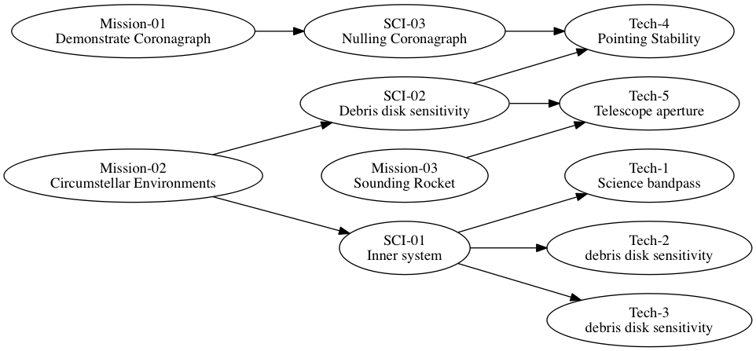

#  Door Stop Template

Requirements

* doorstop (Browning and Adams, 2014, http://dx.doi.org/10.4236/jsea.2014.73020): https://doorstop.readthedocs.io/en/latest/#setup
* pandoc: http://pandoc.org/installing.html
* graphviz: https://pypi.python.org/pypi/graphviz

example setup from command line:

    brew install pandoc
    brew install graphviz
    pip install doorstop
    git clone https://github.mit.edu/edouglas/cgi_requirements
    pip install graphviz

To run the template (a few example subset requirements from the PICTURE sounding rocket to image an debris disk (Chakrabarti et al. 2016)[http://adsabs.harvard.edu/abs/2016JAI.....540004C], (Douglas et al 2016)[http://adsabs.harvard.edu/abs/2016arXiv160700277D]:

    doorstop create L1 ./reqs/L1
    doorstop create L2 ./reqs/L2 --parent L1
    doorstop create L3 ./reqs/L3 --parent L2
    ./doorstop_sync.sh 
    
To Edit:

* make and save edits to the .xlsx file related to the requirement of interest (i.e. sci_L2.xlsx	)
* run _./doorstop_sync.sh_
* commit and push changes to view markdown output

[Linked Requirements Documents and Traceability matrix](dist/index.markdown)

### Published Documents:

-   [L1](dist/L1.markdown)
-   [L2](dist/L2.markdown)
-   [L3](dist/L3.markdown)

## Most recently committed flowchart:

 Requirements flowchart

