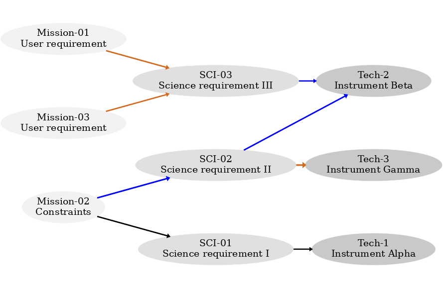

[](https://zenodo.org/badge/latestdoi/68635117)
[](https://github.com/douglase/doorstop_requirements_template/actions/workflows/ci.yml)

#  doorstop Requirements Template


## Features:
* version controlled requirements tracking
* Generates a graphviz diagram (see example at bottom of page) showing relations between requirements
* Uses doorstop's native Markdown publisher to generate GitHub-renderable markdown with working relative links

## Requirements

* Bash
* doorstop >= 3.1 (Browning and Adams, 2014,
  * http://dx.doi.org/10.4236/jsea.2014.73020):
  * https://doorstop.readthedocs.io/en/latest/#setup
* pandoc: http://pandoc.org/installing.html (required only for Beamer/LaTeX PDF output)
* graphviz: https://pypi.python.org/pypi/graphviz
* pdflatex (optional, for Beamer slide output)

## Installation

Install Python dependencies:

    pip install -r requirements.txt

### macOS:

Example setup from command line in OS-X/macOS (with [homebrew](http://brew.sh/) and [pip](https://packaging.python.org/key_projects/#pip)):

    brew install pandoc
    brew install graphviz
    git clone https://github.com/douglase/doorstop_requirements_template
    pip install -r requirements.txt

### Linux

In Ubuntu or other Debian variant:

	sudo apt-get install graphviz
	sudo apt-get install pandoc
	pip install -r requirements.txt

Optional for editing in a spreadsheet: `sudo apt-get install libreoffice`
Optional for generating PDF output: `sudo apt-get install texlive-latex-extra`

> **Note on `PUBLISH_GRANDCHILD_LINKS`:** The previous installation instructions
> referenced a custom `douglase/doorstop` fork that added a
> `PUBLISH_GRANDCHILD_LINKS` setting to display links spanning two or more
> levels (e.g., L1 → L3 directly when an intermediate level is skipped).
> Upstream doorstop v3.1 does not include this setting; it supports
> `PUBLISH_CHILD_LINKS` (direct children) which covers the current template
> data. If you need cross-level link display in future, consider opening a PR
> against [doorstop-dev/doorstop](https://github.com/doorstop-dev/doorstop).
	
## Usage
To run the template (which generates a sample subset of post-facto requirements imagined for the PICTURE sounding rocket to image a debris disk [Chakrabarti et al. 2016](http://adsabs.harvard.edu/abs/2016JAI.....540004C), [Douglas et al 2016](http://adsabs.harvard.edu/abs/2016arXiv160700277D)):

    ./doorstop_sync.sh 
    
The template includes three levels which were created by the following commands:

    doorstop create L1 ./reqs/L1
    doorstop create L2 ./reqs/L2 --parent L1
    doorstop create L3 ./reqs/L3 --parent L2

### To Edit:

* make and save edits to the .csv file related to the requirement of interest (i.e. sci_L2.csv)
	* _this step can be done repeatedly and by users without the dependencies installed_ (by directly editing .csv files on github, for example)
* run _./doorstop_sync.sh_
* commit and push changes to view markdown [output in dist/ directory](dist/L1.md)


[Linked Requirements Documents](dist/L1.md)


## Outputs of the template

### Published Documents:

-   [L1](dist/L1.md)
-   [L2](dist/L2.md)
-   [L3](dist/L3.md)


## Most recently committed flowchart:
 Requirements flowchart


## Continuous Integration 

This repository uses GitHub Actions for CI/CD, see [CI setup guide](guides/CI-setup.md). On each push to `main`, the workflow regenerates all outputs and deploys them to the `gh-pages` branch. For the latest PDF, see: [blob/gh-pages/beamer.pdf](../gh-pages/beamer.pdf)


## Flow of the scripts used to generate flowchart and human readable markdown files:

```
                                   ./doorstop_sync.sh
+---------------------------------------------------------------------------------------------+
|   +-------------------------+                                                               |
|   |INPUT                    |                                                               |
|   |(.CSV or .XLSX):         |                         +---------------------------------+   |
|   |Tables with columns for :|                         | each requirement gets a YAML    |   |
|   |uid, short name,         |                         |(YAML Ain't Markup Language):    |   |
|   |text, links, notes.      | doorstop Python Module  |file w/ name, text, links, notes.|   |
|   |                         +-----------------------> | and its  metadata.              |   |
|   |                         |"doorstop import"        |"*reqs/L1/CGI-BSR0.yml           |   |
|   |  "LevelOneReqs.csv"     |                         | *reqs/L1/CGI-BSR1.yml           |   |
|   |                         |                         | *reqs/L1/..."                   |   |
|   --------------------------+                         +----------+--------------------+-+   |
|                                                                  |                    |     |
|                            doorstop Python Module                |                    +>+   |
|                 +<-----------------------------------------------+                      |   |
|                 |          "doorstop"                                                   |   |
|                 v                                                                       |   |
|         +-------+--------------------------------------------------------------------+  |   |
|         |   parses yaml files, resolves links and warns if unconnected requirements. |  |   |
|         ++---------------------------------------------------------------------------+  |   |
|          |                                                                              |   |
|          |doorstop publish all ./dist -m                                                |   |
|          |                                                                              |   |
|     +----v--------------------------------------------------------------------+         |   |
|     | publishes Markdown (dist/*.md) with parent/child links and GitHub-      |         |   |
|     | compatible anchors. Also publishes HTML to dist/documents/ for Beamer.  |         |   |
|     +-+-----------------------------------------------------------------------+         |   |
|       |                                                                                 |   |
|       | pandoc via MakeBeamer (HTML -> Beamer .tex, for PDF output only)               |   |
|       |                                                                                 |   |
|     +-+------------------------------------------------------------------------------+  |   |
|     | converts HTML to LaTeX Beamer slides. (http://pandoc.org).                     |  |   |
|     ++-------------------------------------------------------------------------------+  |   |
|      |                                                                                  |   |
|      |doorstop python API and Graphviz (via graphviz python module)                    |   |
|      |                                                                                  |   |
|    +-------------------------------------------------------------------------------------+  |
|    |draws connections between each linked requirement and minimizes energy of network   ||  |
|    |and exports requirements network as a png file.                                     ||  |
|    +-------------------------------------------------------------------------------------+  |
|                                                                                             |
|                       made using http://asciiflow.com                                       |
+---------------------------------------------------------------------------------------------+


```

